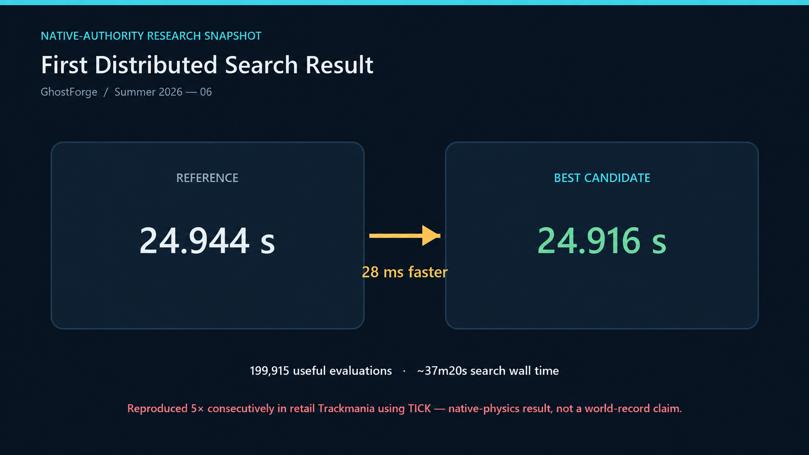
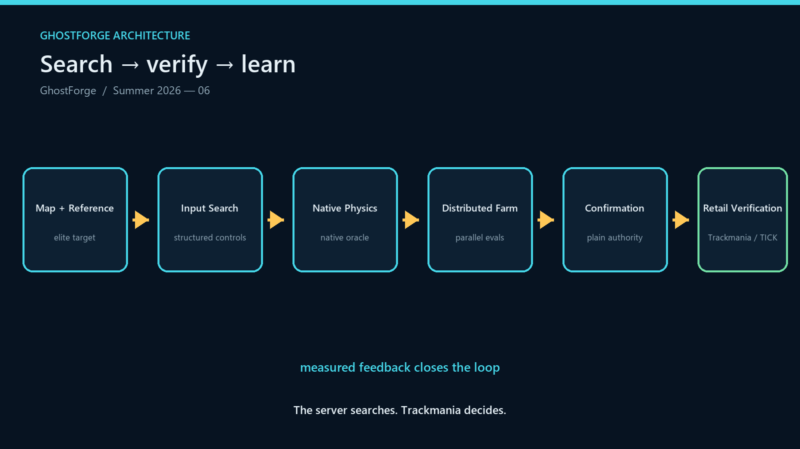
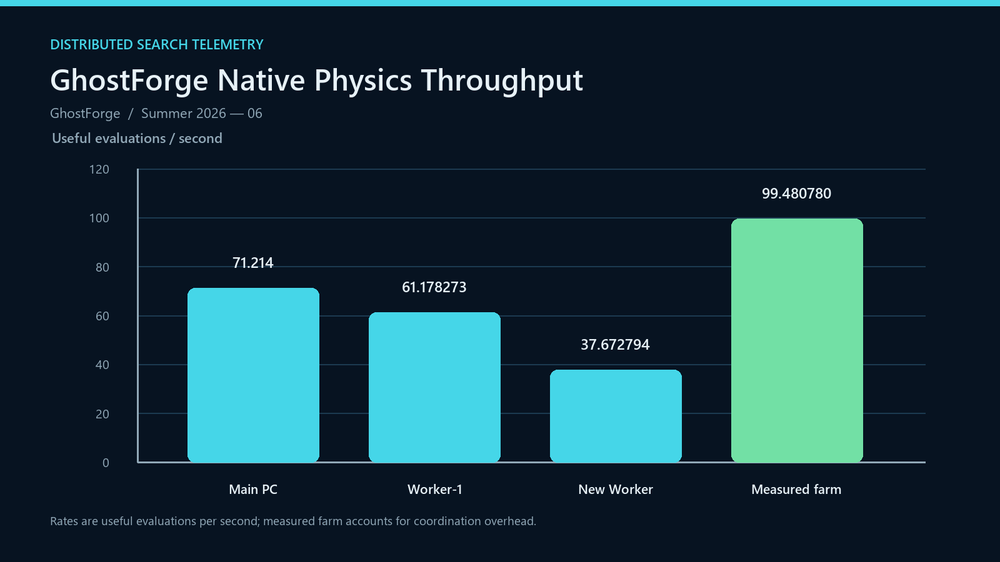

# GhostForge

## Distributed Trackmania TAS Research Lab

> **The server searches. Trackmania decides.**

GhostForge is a distributed Trackmania TAS research and optimization platform. It explores large populations of structured input variations with native Trackmania physics, shares the search across multiple computers, and sends promising candidates back to retail Trackmania for confirmation.

## Headline result

On **Summer 2026 - 06**, GhostForge improved a **24.944 s** reference to **24.916 s** — a **28 ms improvement**. The candidate was reproduced **five consecutive times in retail Trackmania using TICK**. Native physics remains the authority for offline search; this is a measured research result, not a world-record claim.

The first distributed search used **199,915 useful evaluations** over approximately **37 minutes 20 seconds**, with a measured three-node throughput of **99.480780 useful evaluations/second** (about **358,000 evaluations/hour**).



## How it works

```text
Map + reference runs
        ↓
GhostForge search
        ↓
Native Trackmania physics
        ↓
Candidate confirmation
        ↓
Retail Trackmania verification
```

The public model is intentionally simple: search proposes structured controls, native physics evaluates them, and retail Trackmania/TICK confirms promising candidates.



## Performance

| Node | Useful evaluations / second |
| --- | ---: |
| Main PC | 71.214 |
| Worker-1 | 61.178273 |
| New Worker | 37.672794 |
| Measured three-node farm | **99.480780** |

These are useful-evaluation measurements, not a claim that node rates add linearly in every workload.



## Why fullspeed maps are interesting

Tiny improvements in steering angle, speedslide timing, transitions, wallrides, and exit speed can compound over the remainder of a fullspeed run. That makes these maps a useful setting for studying search quality, physics fidelity, and long-horizon optimization.

## Current status

- Track06’s 24.916 s result has five consecutive retail Trackmania/TICK reproductions.
- Native physics remains authoritative for offline candidate search.
- Current research direction: smarter population-based optimization, including Nevergrad integration.
- C25A ephemeral retention and storage cleanup is complete.

## Roadmap

- Finish the public write-up and continue retail verification research.
- Test GhostForge on fullspeed maps.
- Expand to grass, plastic, dirt, and ice.
- Improve distributed search efficiency.
- Investigate targeted trick/contact discovery.
- Eventually ingest maps and elite ghosts automatically.
- After separate publication audits, consider standalone utility repositories for `track-geometry-engine` and a Trackmania raycast/sensor toolkit.

Compiled GhostForge binaries are withheld until a separately approved release candidate exists.

## Private/public boundary

This repository is a showcase of approved concepts, measurements, and branding. Private backend code, Ghost files, credentials, machine details, internal evidence, prompts, coordination data, and proprietary game/server assets are intentionally not included.

